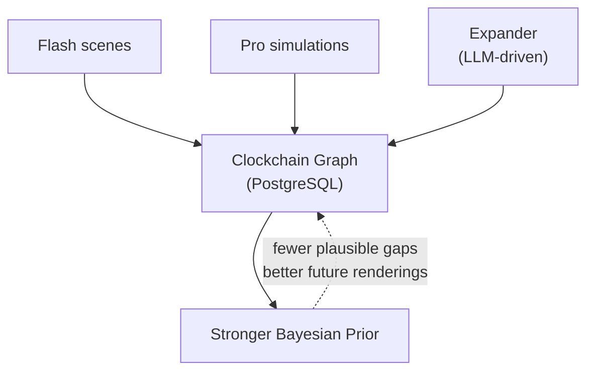

# timepoint-clockchain

**Temporal causal graph for AI agents.** PostgreSQL-backed directed graph of historical moments — canonical spatiotemporal URLs, typed causal edges, autonomous expansion, and browse/search/discovery APIs.

> [!NOTE]
> **Why this exists** — AI agents that reason about causality across time currently rely on web search (noisy, unstructured), knowledge graphs (no temporal dimension), or hallucination. The Clockchain is a structured alternative: every node carries dialog, entity states, provenance, and confidence, addressed by a canonical spatiotemporal URL, in a format ([TDF](https://github.com/timepoint-ai/timepoint-tdf)) designed for machine consumption.

The graph accumulates two layers of rendered reality:

- **Rendered Past** — historical events rendered by [Flash](https://github.com/timepoint-ai/timepoint-flash) with full causal structure, entity states, dialog, and source grounding
- **Rendered Future** — simulation outputs from [Pro](https://github.com/timepoint-ai/timepoint-pro), scored for convergence, stored as TDF records

Each new event with causal edges tightens the Bayesian prior — fewer plausible things *could* have happened in the gaps — approaching asymptotic coverage of any historical period.

*The name is conceptual. This is PostgreSQL, not a blockchain.*



## Suite Context

Part of the [Timepoint AI](https://github.com/timepoint-ai) suite — the Clockchain is the temporal causal graph that all other services read from and write to.

## Graph Architecture

The Clockchain is a directed graph stored in PostgreSQL (two tables: `nodes` and `edges`). Each node is a historical moment identified by a canonical temporal URL. Edges encode typed relationships between moments.

### Canonical URL Format

Every node has a unique spatiotemporal address — 8 segments encoding *when* and *where*:

```
/-44/march/15/1030/italy/lazio/rome/assassination-of-julius-caesar
  │    │    │   │     │     │    │    └── slug (auto-generated)
  │    │    │   │     │     │    └─────── city
  │    │    │   │     │     └──────────── region
  │    │    │   │     └───────────────── country (modern borders)
  │    │    │   └───────────────────── time (24hr, no colon)
  │    │    └───────────────────────── day
  │    └────────────────────────────── month (lowercase name)
  └─────────────────────────────────── year (negative = BCE)
```

Negative years for BCE, all segments kebab-case. This path is both the node’s primary key and its API address.

### Content Layers

| Layer | Content | Storage |
|-------|---------|---------|
| 0 | URL path + event name | Clockchain graph (Postgres `nodes` table) |
| 1 | Metadata: figures, tags, one-liner description | Clockchain graph (Postgres `nodes` table) |
| 2 | Full Flash scene reference | `flash_timepoint_id` field in graph node |

### Edge Types

| Type | Meaning | Auto-linked? |
|------|---------|-------------|
| `causes` | Causal relationship | No -- expander or manual only |
| `contemporaneous` | Same year (+/- 1) | Yes, weight 0.5 |
| `same_location` | Matching country + region + city | Yes, weight 0.5 |
| `thematic` | Overlapping tags (array overlap) | Yes, weight 0.3 |

When a node is added via `add_node()`, the `_auto_link()` method creates bidirectional edges for `contemporaneous`, `same_location`, and `thematic` using efficient `INSERT...SELECT` queries.

### Database Schema

Two tables with indexes:

```sql
nodes (id TEXT PK, type, name, year, month, month_num, day, time,
       country, region, city, slug, layer, visibility, created_by,
       tags TEXT[], one_liner, figures TEXT[], flash_timepoint_id,
       flash_slug, flash_share_url, era, created_at, published_at)

edges (source TEXT FK, target TEXT FK, type TEXT CHECK(...),
       weight FLOAT, theme TEXT, PK(source, target, type))
```

Indexes on: visibility, (month, day), year, (country, region, city), GIN on tags/figures, GIN trigram on name/one_liner (when pg_trgm is available).

### Source Types

Each node carries a `source_type` field indicating its origin:

| Type | Meaning |
|------|---------|
| `historical` | Verified historical event (seed data or curated) |
| `expander` | Generated by autonomous graph expansion (LLM-driven) |
| `simulation` | Output from Pro temporal simulation |
| `predicted` | Rendered Future awaiting validation |

Recent: `source_type` field added via migration. Subgraph ingest endpoint (`/api/v1/ingest/subgraph`). Extended `/api/v1/stats` with source_type breakdown.

### Interoperability

Clockchain nodes are expressible as TDF records via `timepoint-tdf`. Coverage and quality metrics feed the planned **Timepoint Futures Index (TFI)**.

**Proof of Causal Convergence (PoCC)** is a future protocol concept: multiple independent renderings that converge on the same causal structure provide validation without ground truth. The Clockchain is the natural accumulation point for convergent paths.

## Autonomous Workers

Four background workers handle content generation and graph growth:

| Worker | File | Purpose | Feature Flag |
|--------|------|---------|-------------|
| **Renderer** | `app/workers/renderer.py` | HTTP client for Flash scene generation (`generate_sync`, `get_timepoint`) | Always available |
| **Expander** | `app/workers/expander.py` | LLM-driven autonomous graph growth; picks low-degree frontier nodes and generates related events via OpenRouter | `EXPANSION_ENABLED=true` + `OPENROUTER_API_KEY` |
| **Judge** | `app/workers/judge.py` | LLM content moderation gate; classifies queries as approve/sensitive/reject via OpenRouter | Used during generation flow |
| **Daily** | `app/workers/daily.py` | "Today in History" cron; finds date-matching events without Flash scenes and queues generation | `DAILY_CRON_ENABLED=true` |

### How the Graph Grows

```
pick frontier node (degree < 3)
         ↓
LLM generates 3–5 related events
         ↓
add_node() → _auto_link()
  · causal edges to source node
  · temporal / spatial / thematic auto-edges
         ↓
sleep 300s → repeat
```

The Expander runs on a configurable interval (default 300s). The Daily worker adds a parallel growth path: every 24 hours, events matching today’s date get queued for Flash scene rendering (up to 5 per day).

## API Endpoints

All endpoints require `X-Service-Key` header except `/health` and `/`. These are exposed to the platform through Flash's proxy at `/api/v1/clockchain/*`.

### Browse and Discovery

| Method | Endpoint | Description |
|--------|----------|-------------|
| `GET` | `/health` | Health check (no auth) |
| `GET` | `/api/v1/browse` | List root segments (years) |
| `GET` | `/api/v1/browse/{path}` | Hierarchical path listing (public moments only) |
| `GET` | `/api/v1/moments/{path}` | Full moment data by canonical URL |
| `GET` | `/api/v1/today` | Events matching today's month/day |
| `GET` | `/api/v1/random` | Random public moment (Layer 1+) |
| `GET` | `/api/v1/search?q={query}` | Full-text search (ILIKE + array unnest for tags/figures) |

### Graph

| Method | Endpoint | Description |
|--------|----------|-------------|
| `GET` | `/api/v1/graph/neighbors/{path}` | Connected nodes with edge metadata |
| `GET` | `/api/v1/stats` | Graph statistics (node/edge counts by layer and type) |

### Generation and Indexing

| Method | Endpoint | Description |
|--------|----------|-------------|
| `POST` | `/api/v1/generate` | Queue scene generation via Flash |
| `GET` | `/api/v1/jobs/{job_id}` | Poll job status |
| `POST` | `/api/v1/moments/{path}/publish` | Set visibility to public |
| `POST` | `/api/v1/bulk-generate` | Bulk generation (requires `ADMIN_KEY`) |
| `POST` | `/api/v1/index` | Add or update a moment in the graph |
| `POST` | `/api/v1/expand-once` | Trigger one expansion cycle (requires `OPENROUTER_API_KEY`) |
| `POST` | `/api/v1/ingest/subgraph` | Bulk-ingest a causal subgraph (nodes + edges) |

## Architecture

```
timepoint-clockchain/
├── app/
│   ├── main.py              # FastAPI app, lifespan, health endpoint
│   ├── api/
│   │   ├── __init__.py      # API router aggregation
│   │   ├── moments.py       # /moments, /browse, /today, /random, /search
│   │   ├── generate.py      # /generate, /jobs, /publish, /bulk-generate, /index
│   │   └── graph.py         # /graph/neighbors, /stats
│   ├── core/
│   │   ├── config.py        # Settings (pydantic-settings)
│   │   ├── auth.py          # Service key + user ID extraction
│   │   ├── db.py            # asyncpg pool, schema DDL, seeding
│   │   ├── graph.py         # PostgreSQL-backed GraphManager (async)
│   │   ├── url.py           # Canonical temporal URL system
│   │   └── jobs.py          # In-memory job queue
│   ├── workers/
│   │   ├── renderer.py      # Flash HTTP client
│   │   ├── expander.py      # Autonomous graph expansion (OpenRouter)
│   │   ├── judge.py         # LLM content moderation (OpenRouter)
│   │   └── daily.py         # "Today in History" daily worker
│   └── models/
│       └── schemas.py       # Pydantic response/request models
├── data/
│   └── seeds.json           # 5 seed historical events
├── scripts/
│   └── migrate_graph_json.py # One-time migration from graph.json to Postgres
├── tests/
├── Dockerfile
├── railway.json
└── pyproject.toml
```

## Setup

```bash
# Install dependencies
pip install -e ".[dev]"

# Or with uv
uv sync

# Copy env template and fill in your keys
cp .env.example .env
```

### PostgreSQL

Clockchain requires a PostgreSQL database. The schema is created automatically on startup.

```bash
# Local dev (macOS)
brew services start postgresql@16
createdb clockchain

# Or via Docker
docker run -d -p 5432:5432 -e POSTGRES_PASSWORD=test -e POSTGRES_DB=clockchain postgres:16
```

Set `DATABASE_URL` in your `.env`:
```
DATABASE_URL=postgresql://localhost:5432/clockchain
```

## Running

```bash
uvicorn app.main:app --port 8080
```

On startup, the service:
1. Creates an asyncpg connection pool
2. Runs schema DDL (CREATE TABLE IF NOT EXISTS)
3. Seeds the database from `seeds.json` if the nodes table is empty
4. Starts the GraphManager, workers, and API server

## Environment Variables

| Variable | Required | Default | Description |
|----------|----------|---------|-------------|
| `DATABASE_URL` | Yes | | PostgreSQL connection URL |
| `SERVICE_API_KEY` | Yes | | Shared secret for inbound service auth |
| `FLASH_URL` | No | `http://timepoint-flash-deploy.railway.internal:8080` | Flash service URL |
| `FLASH_SERVICE_KEY` | Yes | | Auth key for Flash API calls |
| `DATA_DIR` | No | `./data` | Directory for seed data |
| `ENVIRONMENT` | No | `development` | Environment name |
| `DEBUG` | No | `false` | Enable debug logging |
| `PORT` | No | `8080` | Server port |
| `OPENROUTER_API_KEY` | No | | OpenRouter API key (for expander + judge) |
| `OPENROUTER_MODEL` | No | `google/gemini-2.0-flash-001` | Model for AI workers |
| `EXPANSION_ENABLED` | No | `false` | Enable autonomous graph expansion |
| `DAILY_CRON_ENABLED` | No | `false` | Enable "Today in History" worker |
| `ADMIN_KEY` | No | | Key for bulk generation endpoint |

## Testing

Tests run against a real PostgreSQL database (no mocks):

```bash
createdb clockchain_test
DATABASE_URL=postgresql://localhost:5432/clockchain_test pytest tests/ -v
```

59 tests covering: graph operations, edge auto-linking, API endpoints, health checks, generation/indexing, expander/daily workers, content judge, and URL parsing.

## Deployment

Deployed on Railway via the [timepoint-clockchain-deploy-private](https://github.com/timepoint-ai/timepoint-clockchain-deploy-private) repo. See that repo for Railway configuration, entrypoint behavior, and production environment details.

## Seed Data

5 initial events loaded from `data/seeds.json` when the database is empty:

1. Assassination of Julius Caesar (-44 BCE)
2. Trinity Test (1945)
3. Apollo 12 Lightning Launch (1969)
4. Apollo 11 Moon Landing (1969)
5. AlphaGo Move 37 (2016)

## Timepoint Suite

Open-source engines for temporal AI. Render the past. Simulate the future. Score the predictions. Accumulate the graph.

#### Open Source — Engines

| Repo | Role |
|------|------|
| [**Flash**](https://github.com/timepoint-ai/timepoint-flash) | Reality Writer — renders grounded historical moments (Synthetic Time Travel) |
| [**Pro**](https://github.com/timepoint-ai/timepoint-pro) | Simulation Engine — SNAG-powered temporal simulation, TDF output |
| **Clockchain** *(this repo)* | **Temporal Causal Graph — Rendered Past + Rendered Future, growing 24/7** |
| [**SNAG Bench**](https://github.com/timepoint-ai/timepoint-snag-bench) | Quality Certifier — measures Causal Resolution across renderings |
| [**Proteus**](https://github.com/timepoint-ai/proteus-markets) | Settlement Layer — prediction markets that validate Rendered Futures |
| [**TDF**](https://github.com/timepoint-ai/timepoint-tdf) | Data Format — JSON-LD interchange across all services |

#### Private — Applications

| Service | Role |
|---------|------|
| **Web App** | Browser client at `app.timepointai.com` |
| **iPhone App** | iOS — Synthetic Time Travel on mobile |
| **Billing** | Apple IAP + Stripe payment processing |
| **Landing** | Marketing site at `timepointai.com` |

**The Timepoint Thesis** — a forthcoming paper formalizing the Rendered Past / Rendered Future framework, the mathematics of Causal Resolution, the TDF specification, and the Proof of Causal Convergence protocol. Follow [@seanmcdonaldxyz](https://x.com/seanmcdonaldxyz) for updates.

## Author

**Sean McDonald** ([@seanmcdonaldxyz](https://x.com/seanmcdonaldxyz) · [realityinspector](https://github.com/realityinspector))

License: Apache 2.0
